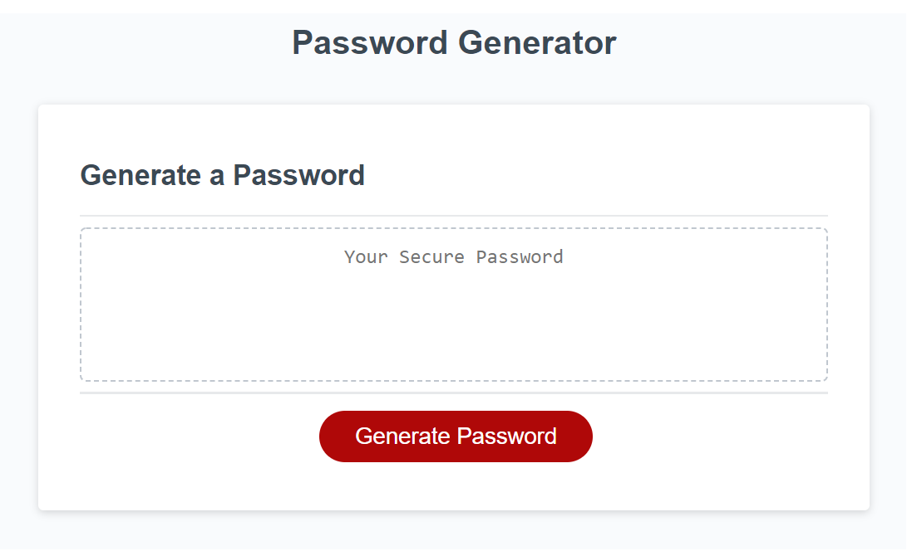
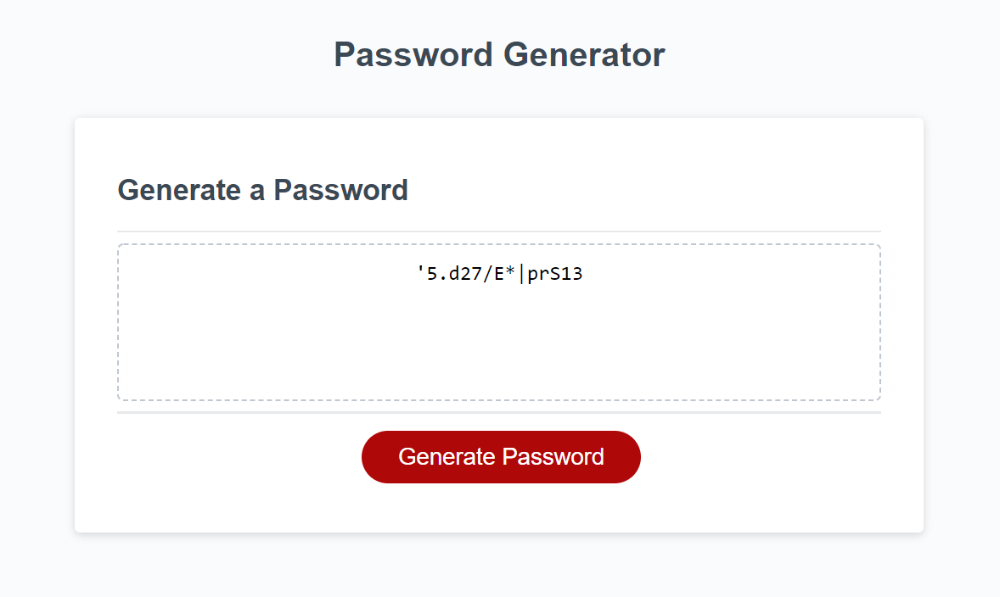

# JavaScript-Random-Password-Generator

## Description

A random password generator that allows users to set password parameters through prompts.  

## [Try it yourself!](https://maestroluu.github.io/JavaScript-Random-Password-Generator/)

The following images show a glimpse of the application:

## Getting Started

This is a simple application that runs right in the browser, no installation or downloads needed.

## Built With:

HTML  
JavaScript 
CSS

## Author:

David Luu

## Planned Updates

There are no plans to further update this application at this time.